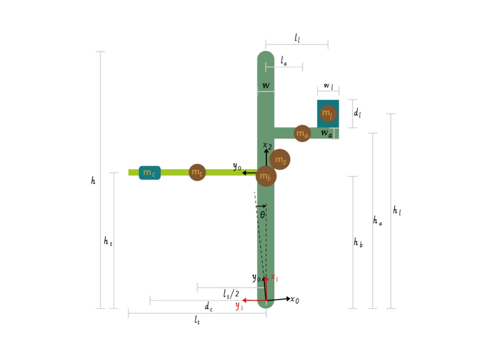

# Assistive_Tail_Simulation_Analysis
The core function in the project - assistive tails for human balance (linear counter mass tail and swing arc tail)

The illustrtaion of physical abstract model of human body and assistive tail is below:

